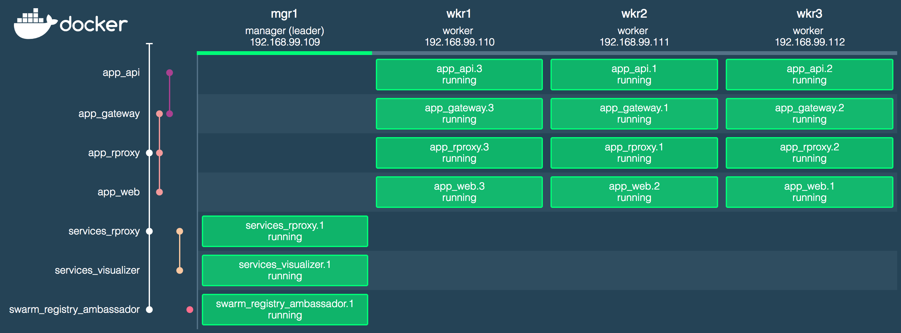

This repo is a noddy web ui and proxied api (on a private network) with `version 3` compose files that are designed to be deployed into a "Docker in swarm mode" cluster.

There are 2 compose files. One for a private Docker registry and swarm visualiser (available on the swarm's port 8080). The other is for the web and api containers.



Incoming requests can hit any node of the swarm and will be routed by the swarm's load balancer. However, in AWS you would have an ELB/ALB pointing at the autoscaling group(s) to protect against losing a node. To simulate this, you can use nginx as a load balancer for the nodes in the swarm. See the [section below](#using-nginx-as-load-balancer).

## To set up the cluster
1.  Install VirtualBox and Docker for Mac

1.  Create 4 VMs using `docker-machine`. We're turning on experimental features so that we can do things like `docker service logs`. Also we're allowing the docker engine to talk to an insecure private registry on the cluster (can't really be bothered to set up SSL for this).

    ```bash
    for node in mgr1 wkr1 wkr2 wkr3
    do
      docker-machine create --driver=virtualbox --engine-opt experimental=true --engine-insecure-registry localhost:5000 $node
    done
    ```
    You should be able to see four machines:
    ```sh
    docker-machine ls
    NAME   ACTIVE   DRIVER       STATE     URL                         SWARM   DOCKER        ERRORS
    mgr1   *        virtualbox   Running   tcp://192.168.99.106:2376           v17.04.0-ce
    wkr1   -        virtualbox   Running   tcp://192.168.99.107:2376           v17.04.0-ce
    wkr2   -        virtualbox   Running   tcp://192.168.99.108:2376           v17.04.0-ce
    wkr3   -        virtualbox   Running   tcp://192.168.99.109:2376           v17.04.0-ce  
    ```

1.  Point local Docker to the manager node:

    ```sh
    eval $(docker-machine env --shell=bash mgr1)
    ```

1.  Create a swarm:

    ```sh
    docker swarm init --advertise-addr $(docker-machine ip mgr1)
    ```

1.  Join the workers to the swarm:

    ```bash
    for node in wkr1 wkr2 wkr3
    do
      docker --host=tcp://$(docker-machine ip $node):2376 swarm join --token $(docker swarm join-token worker --quiet) $(docker-machine ip mgr1):2377
    done
    ```

    You should now have a cluster with one manager and 3 workers:

    ```sh
    docker node ls
    ID                           HOSTNAME  STATUS  AVAILABILITY  MANAGER STATUS
    mtwmobz3ow6tdbplktjc36w7b    wkr2      Ready   Active
    p3kzv15pwso77c8ok3wgz8u7b *  mgr1      Ready   Active        Leader
    q3g17wlf08eqbrntks3mt1710    wkr3      Ready   Active
    z7b3qp771b2258gh3js9f6t7r    wkr1      Ready   Active
    ```

1.  Create a folder on the manager for the registry data (you will need to do this again if the `mgr1` node's vm is restarted because only `/var/lib/docker` and `/var/lib/boot2docker` are persisted between restarts)

    ```sh
    docker-machine ssh mgr1 sudo mkdir /var/lib/registry
    ```

1.  Deploy the services stack (registry and visualiser)

    ```sh
    docker stack deploy --compose-file=docker-compose-services.yml services
    ```

1.  Build and push images

    ```sh
    docker-compose -f docker-compose-app.yml build
    docker-compose -f docker-compose-app.yml push
    ```

1.  Create a secret that the `api` service will use (note we use `printf` instead of `echo` to prevent a new-line being added)

    ```sh
    printf 'sssshhhh!' | docker secret create my_secret -
    ```

1.  Deploy the app stack

    ```sh
    docker stack deploy --compose-file=docker-compose-app.yml app
    ```

    You should now see all the services running

    ```sh
    docker service ls
    ID            NAME                 MODE        REPLICAS  IMAGE
    kipckpfkq5by  app_web              replicated  3/3       localhost:5000/web:latest
    mrn49lbgchxf  services_registry    replicated  1/1       registry:2
    n6pm2oq5jlv8  services_visualizer  replicated  1/1       dockersamples/visualizer:stable
    pcmj953eucx5  app_api              replicated  3/3       localhost:5000/api:latest
    ```

## Cleaning up

```sh
docker-machine rm -f mgr1 wkr1 wkr2 wkr3
```

## Using nginx as load balancer

1.  If your local docker is pointing to the swarm manager you can use the `point-to-local` script to unset the docker env variables in order to point back to your local xhyve instance in Docker for Mac.

    ```bash
    source ./point-to-local.sh
    ```

1.  We are going to run nginx in a container locally (i.e. not in the swarm) in order to load balance requests between the nodes in the swarm. This is also needed so that when calling the web ui in this example project, the browser can also access the api without using CORS etc.

    The `start.sh` script injects the swarm nodes' ip addresses into the upstream section of the nginx config and starts nginx with that config in a local container. You should run this from the repo root.

    ```bash
    sh nginx/start.sh
    ```

1.  To cleanup you should stop and remove the `load-balancer` containers

    ```bash
    docker stop load-balancer
    docker rm load-balancer
    ```

A note about overlay networks
-----

Be careful of clashes between `Boot2Docker`'s networking and `docker swarm`'s overlay networks
(they both use `10.0.n/24`). This is why we change the subnet for the `private` overlay network in
[the compose file](./docker-compose-app.yml) (as we ended up looking for a DNS server on the
`private` network rather than on the host)
